

# Josh Burgess

*Software engineer. Prolific builder.*  
*Interested in type systems, functional programming, performance, and building reliable software.*

[Home](https://joshburgess.github.io/) &nbsp;·&nbsp; [Tech Blog](https://joshburgess.github.io/blog/)

---

## Projects

Click the ▸ icon next to each language banner or the banner itself to expand and see the projects written in that language.

<picture></picture><picture><source media="(max-width: 768px)" srcset="assets/banners/rust-narrow.svg"><source media="(max-width: 1280px)" srcset="assets/banners/rust-mid.svg"></picture>

<a href="https://github.com/joshburgess/typeway"><picture><source media="(max-width: 768px)" srcset="assets/tiles/typeway-narrow.svg"><source media="(max-width: 1280px)" srcset="assets/tiles/typeway-mid.svg">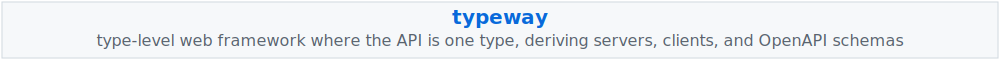</picture></a>

<a href="https://github.com/joshburgess/resolute"><picture><source media="(max-width: 768px)" srcset="assets/tiles/resolute-narrow.svg"><source media="(max-width: 1280px)" srcset="assets/tiles/resolute-mid.svg">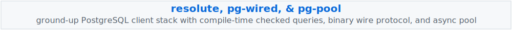</picture></a>

<a href="https://github.com/joshburgess/proptest-lockstep"><picture><source media="(max-width: 768px)" srcset="assets/tiles/proptest-lockstep-narrow.svg"><source media="(max-width: 1280px)" srcset="assets/tiles/proptest-lockstep-mid.svg">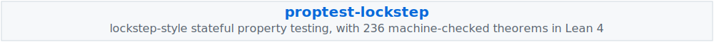</picture></a>

<a href="https://github.com/joshburgess/reify-reflect"><picture><source media="(max-width: 768px)" srcset="assets/tiles/reify-reflect-narrow.svg"><source media="(max-width: 1280px)" srcset="assets/tiles/reify-reflect-mid.svg">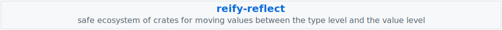</picture></a>

<a href="https://github.com/joshburgess/elm-ast"><picture><source media="(max-width: 768px)" srcset="assets/tiles/elm-ast-narrow.svg"><source media="(max-width: 1280px)" srcset="assets/tiles/elm-ast-mid.svg">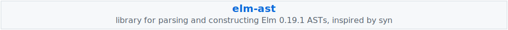</picture></a>

<a href="https://github.com/joshburgess/elm-assist"><picture><source media="(max-width: 768px)" srcset="assets/tiles/elm-assist-narrow.svg"><source media="(max-width: 1280px)" srcset="assets/tiles/elm-assist-mid.svg">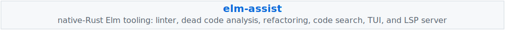</picture></a>

<a href="https://github.com/joshburgess/elm-client-gen"><picture><source media="(max-width: 768px)" srcset="assets/tiles/elm-client-gen-narrow.svg"><source media="(max-width: 1280px)" srcset="assets/tiles/elm-client-gen-mid.svg">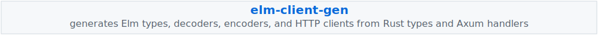</picture></a>

<a href="https://github.com/joshburgess/mythic"><picture><source media="(max-width: 768px)" srcset="assets/tiles/mythic-narrow.svg"><source media="(max-width: 1280px)" srcset="assets/tiles/mythic-mid.svg">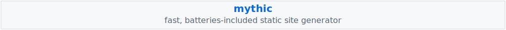</picture></a>

<a href="https://github.com/joshburgess/hoogle-tui"><picture><source media="(max-width: 768px)" srcset="assets/tiles/hoogle-tui-narrow.svg"><source media="(max-width: 1280px)" srcset="assets/tiles/hoogle-tui-mid.svg">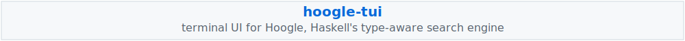</picture></a>

<a href="https://github.com/joshburgess/cabalist"><picture><source media="(max-width: 768px)" srcset="assets/tiles/cabalist-narrow.svg"><source media="(max-width: 1280px)" srcset="assets/tiles/cabalist-mid.svg">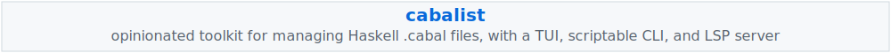</picture></a>

<picture></picture><picture><source media="(max-width: 768px)" srcset="assets/banners/haskell-narrow.svg"><source media="(max-width: 1280px)" srcset="assets/banners/haskell-mid.svg"></picture>

<a href="https://github.com/joshburgess/acolyte"><picture><source media="(max-width: 768px)" srcset="assets/tiles/acolyte-narrow.svg"><source media="(max-width: 1280px)" srcset="assets/tiles/acolyte-mid.svg">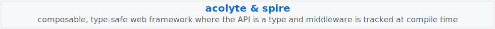</picture></a>

<a href="https://github.com/joshburgess/valiant"><picture><source media="(max-width: 768px)" srcset="assets/tiles/valiant-narrow.svg"><source media="(max-width: 1280px)" srcset="assets/tiles/valiant-mid.svg">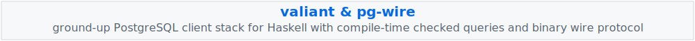</picture></a>

<a href="https://github.com/joshburgess/hedgehog-lockstep"><picture><source media="(max-width: 768px)" srcset="assets/tiles/hedgehog-lockstep-narrow.svg"><source media="(max-width: 1280px)" srcset="assets/tiles/hedgehog-lockstep-mid.svg">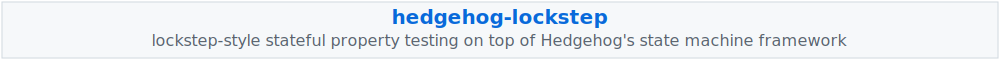</picture></a>

<picture></picture><picture><source media="(max-width: 768px)" srcset="assets/banners/typescript-narrow.svg"><source media="(max-width: 1280px)" srcset="assets/banners/typescript-mid.svg"></picture>

<a href="https://github.com/joshburgess/aeon"><picture><source media="(max-width: 768px)" srcset="assets/tiles/aeon-narrow.svg"><source media="(max-width: 1280px)" srcset="assets/tiles/aeon-mid.svg">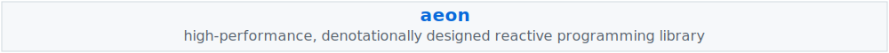</picture></a>

<a href="https://github.com/joshburgess/kinem"><picture><source media="(max-width: 768px)" srcset="assets/tiles/kinem-narrow.svg"><source media="(max-width: 1280px)" srcset="assets/tiles/kinem-mid.svg">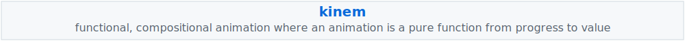</picture></a>

<a href="https://github.com/joshburgess/tachys"><picture><source media="(max-width: 768px)" srcset="assets/tiles/tachys-narrow.svg"><source media="(max-width: 1280px)" srcset="assets/tiles/tachys-mid.svg">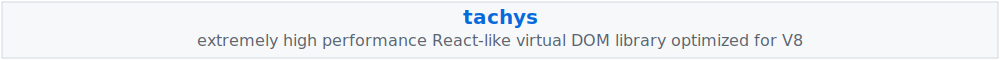</picture></a>

<a href="https://github.com/joshburgess/tagged-ts"><picture><source media="(max-width: 768px)" srcset="assets/tiles/tagged-ts-narrow.svg"><source media="(max-width: 1280px)" srcset="assets/tiles/tagged-ts-mid.svg">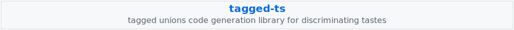</picture></a>

<picture></picture><picture><source media="(max-width: 768px)" srcset="assets/banners/elm-narrow.svg"><source media="(max-width: 1280px)" srcset="assets/banners/elm-mid.svg"></picture>

<a href="https://github.com/joshburgess/elm-route-craft"><picture><source media="(max-width: 768px)" srcset="assets/tiles/elm-route-craft-narrow.svg"><source media="(max-width: 1280px)" srcset="assets/tiles/elm-route-craft-mid.svg">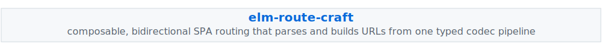</picture></a>

